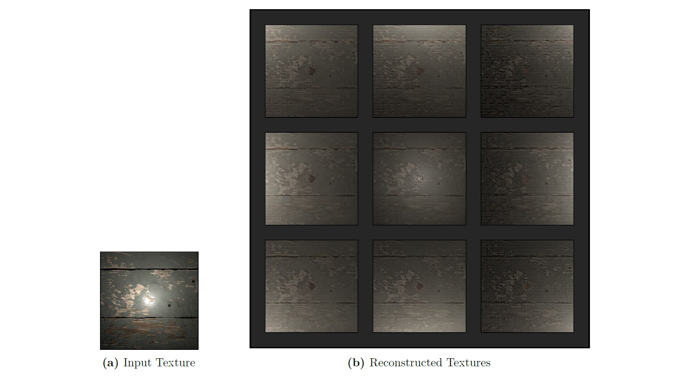
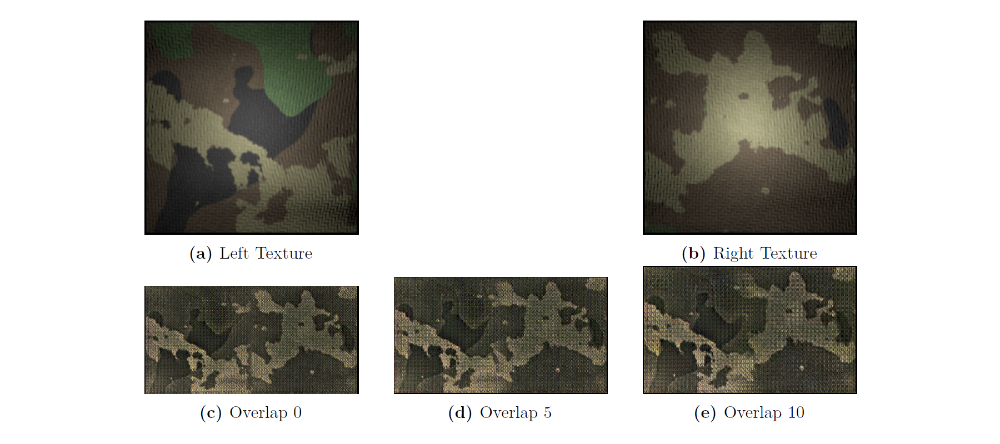
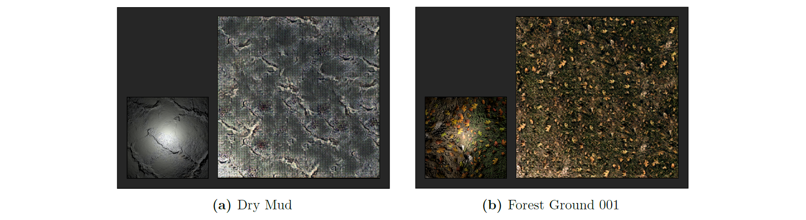

## SVBRDF Texture Synthesis with Convolutional Autoencoders
A thesis submitted in partial completion of the degree *Master of Science in Computer Science* at Oxford University.

### Abstract
An outstanding problem in texture synthesis research is accurately inferring the spatially-varying bidirectional reflectance distribution function (SVBRDF) which characterizes the visual appearance of a surface for any combination of lighting and viewing conditions. Another open research question concerns modelling the underlying generative process of a texture in order to expand its spatial extent to the infinite plane. This research project explores joint solutions to both of these tasks using convolutional autoencoders. Specifically, the goal is to train a machine learning model that accepts a single fronto-parallel flash-lit photograph of a texture as input and produces an SVBRDF parameterization of the same texture as output. This is achieved by optimizing a convolutional autoencoder to minimize the perceptual difference between two renderings of a texture based on the predicted and ground-truth SVBRDF parameters, respectively. The final performance of the model is evaluated with respect to its ability to  reconstruct, interpolate, and expand textures.

### Results
Reconstruction results for a sample from the *SP 1 Old Painted Planks* texture under different point lights.

Interpolation results for two samples of the *Camouflage 001* texture under a directional light.

Expansion results for samples from the *Dry Mud* and *Forest Ground 001* textures under a directional light.


### Layout
| Item | Description |
| :--- | :--- |
| [`project/`](project/) | Source code† for training‡ and testing the SVBRDF Autoencoder. |
| [`sandbox/`](sandbox/) | Source code† for several classical texture synthesis algorithms. |
| [`thesis.pdf`](thesis.pdf) | Dissertation associated with the research project. |

† An execution guide is provided in Appendix B of `thesis.pdf` (where `sandbox` replaces `classic`).

‡ The dataset used to train the SVBRDF Autoencoder is not included in this repository.

### Licensing
* The `project` and `sandbox` source code is licensed under an [MIT License](https://opensource.org/licenses/MIT).
* The `thesis.pdf` file is licensed under a [CC-BY 4.0 License](https://creativecommons.org/licenses/by/4.0/).

### Citation
Please cite this work using the following BibTeX entry:
```
@mastersthesis{Andrenkov2020SVBRDF,
    title={{SVBRDF Texture Synthesis with Convolutional Autoencoders}},
    author={Andrenkov, Mikhail},
    school={University of Oxford},
    year=2020,
    month=9
}
```
